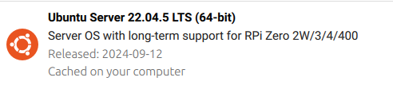

# DiffDrivePWM-ROS2-MotorController
A ROS2 package to drive 2 DC motors with PWM generated by Raspberry PI 4

## Prepare the Raspberry PI 4

### Install Ubuntu 22.04

ROS2 Humble requires Ubuntu 22.04

On your development computer, use Raspberry imager to create an SD card with 



### Install ROS2 Humble on the Raspberry PI 4

* Follow these instructions: https://docs.ros.org/en/humble/Installation/Ubuntu-Install-Debs.html
* When you arrive at "Install ROS 2 packages" install only:
  
`sudo apt install ros-humble-ros-base`

`sudo apt install ros-dev-tools`

and stop there.

* Source setup: to use ROS2 you need to source it and the best option is to add

  `source /opt/ros/humble/setup.bash`

  at the end of your .bashrc

## Create the ROS2 

### Overview 
This package, written in C++:
* controls two DC motors using PWM
* PWM is generated by the Raspberry Pi 4 itself, with pigpio,
* the electronics is a simple "H bridge" based on DRV8833 IC.
* subscribes to the RSO2 topic /cmd_vel
* has two optional parameters:
  * wheels_distance
  * max_speed

### Steps to Create the ROS2 Package

1) __Install pigpio__
   
  
   ```
   wget https://github.com/joan2937/pigpio/archive/master.zip
   unzip master.zip
   cd pigpio-master
   make
   sudo make install
   ```
2) __Enable and start pigpio daemon on boot__

   ```
   sudo cp util/pigpiod.service /etc/systemd/system
   sudo cp /usr/local/bin/pigpiod /usr/bin/pigpiod
   sudo systemctl start pigpiod
   sudo systemctl enable pigpiod
   ```
   
3) __Clone this repository__

3. Build this package

4. Source this package

5. Test
